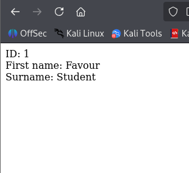
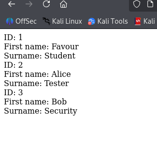

# 🛡️ SQL Injection Lab — Exploit & Fix


**I built a web app, hacked it with SQL injection, then fixed it.** This lab shows the full cycle: build → exploit → fix → verify — on an isolated Kali Linux setup using only test data.

| | |
|---|---|
| **What** | SQL Injection (OWASP Top 10 — A03) |
| **How** | Payload `' OR '1'='1` in a URL parameter |
| **Impact** | Dumped the entire database instead of one record |
| **Fix** | Prepared statements (parameterised queries) |
| **Result** | ✅ Attack blocked · app still works |

> ⚠️ All testing was local (`127.0.0.1`), on an app I built for practice. No real systems or data involved.

---

## 1️⃣ Normal Behaviour

The app looks up a user by ID. Asking for `id=1` correctly returns **only** user 1:



Behind the scenes:
```sql
SELECT first_name, surname FROM users WHERE user_id = '1';
```

---

## 2️⃣ The Attack

Instead of an ID, I entered:
```
' OR '1'='1
```

The app dumped **every record** in the database:



---

## 3️⃣ Why It Worked

My input changed the query's logic:

```sql
SELECT ... WHERE user_id = '' OR '1'='1';
```

```
user_id = ''   →  false
'1' = '1'      →  ALWAYS true
false OR true  →  true for EVERY row  →  whole table dumped
```

**Root cause:** the app mixed user input directly into the SQL — so my input became *code* instead of *data*.

---

## 4️⃣ The Fix

**Prepared statements** — bind the input as data so it can never run as code:

```
❌ Before:  "... WHERE user_id = '" + input + "'"     (input = code)
✅ After:   "... WHERE user_id = ?"  + bind(input)    (input = data)
```

```
Before fix:  ' OR '1'='1  →  runs as code  →  dumps all rows
After fix:   ' OR '1'='1  →  treated as text →  matches nothing
```

✅ **Verified:** after the fix, `id=1` still returned user 1, and the injection returned nothing.

---

## 🔵 Why It Matters for SOC Work

Having done the attack, I know its footprint in logs — SQL operators like `' OR '1'='1` in a URL parameter are a red flag an analyst can hunt for in web logs or a SIEM.

**Prevention checklist:**
- ✅ Prepared statements *(the main fix)*
- ✅ Input validation (IDs = numbers only)
- ✅ Least-privilege database account
- ✅ Web Application Firewall

---

## 🧰 Skills Shown

`Kali Linux` · `PHP + MariaDB` · `SQL injection` · `root-cause analysis` · `prepared statements` · `secure remediation` · `SOC log indicators` · `ethical testing`

---

## 📎 Evidence

| File | Shows |
|------|-------|
| `01_working_browser_database_records.png` | App working — 3 records in the database |
| `02_baseline_id_1.png` | Normal request (`id=1` → one user) |
| `03_sql_injection_all_records.png` | Injection (`' OR '1'='1` → all users) |

---

**References:** [OWASP SQL Injection](https://owasp.org/www-community/attacks/SQL_Injection) · [OWASP Prevention Cheat Sheet](https://cheatsheetseries.owasp.org/cheatsheets/SQL_Injection_Prevention_Cheat_Sheet.html) · [PortSwigger SQLi](https://portswigger.net/web-security/sql-injection)
